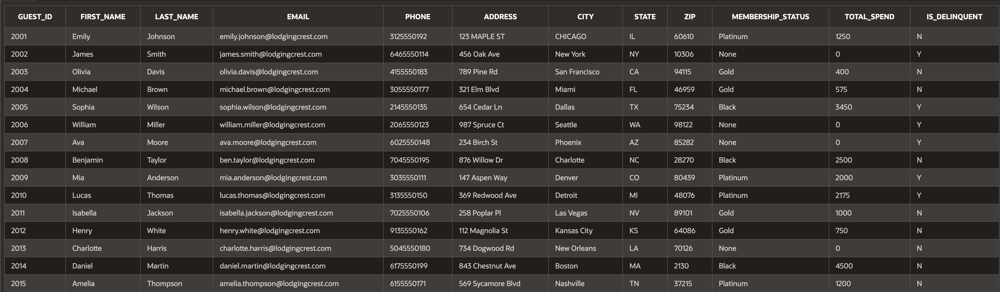
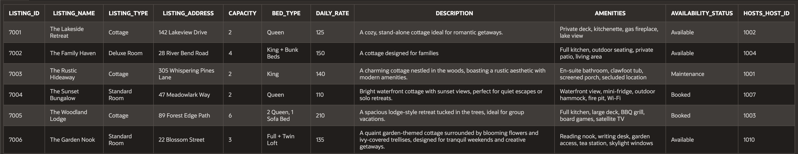
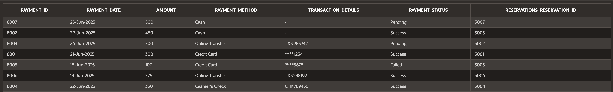

# BNB Database Modeling Project

## Overview
Designed and implemented a normalized relational database for **The Lakeside Haven**, a bed-and-breakfast reservation system.

This project replaces manual and fragmented data management with a structured Oracle SQL database that supports guest tracking, reservations, payments, and membership programs.

---

## Problem
The business struggled with:
- Disorganized guest and reservation data
- Limited payment options
- Difficulty managing new lodging types
- No system for loyalty programs or growth

---

## Solution
Built a centralized database system with:
- Guests, Hosts, Listings, Reservations, Payments
- Membership tiers and guest history tracking
- Fully normalized schema (3NF)
- Strong referential integrity

---

## Technologies
- Oracle Database 11g
- SQL (DDL & DML)
- Oracle SQL Developer Data Modeler
- Oracle APEX

---

## Key Features

### Database Design
- 3rd Normal Form (3NF)
- Logical & Relational ERD modeling

### SQL Implementation
- Primary & Foreign Keys
- Unique & Check Constraints
- Sequences for auto-generated IDs
- Indexes for performance optimization
- Views for simplified data access
- Synonyms for abstraction

---

## Database Diagrams

### Logical Model

### Relational Model

---

## Sample Data

### Guests

### Listings

### Payments

---

## How to Run

1. Run:
   - `create_tables.sql`
2. Then:
   - constraints, sequences, indexes
3. Run:
   - `create_views.sql`
   - `create_table_synonyms.sql`
4. Insert sample data:
   - `create_insert_into_tables.sql`

---

## Skills Demonstrated
- Database Design & Normalization
- SQL Development (DDL/DML)
- Data Modeling (ERD → Relational Schema)
- Performance Optimization (Indexes)
- Data Integrity (Constraints)

---

## License
Academic use
